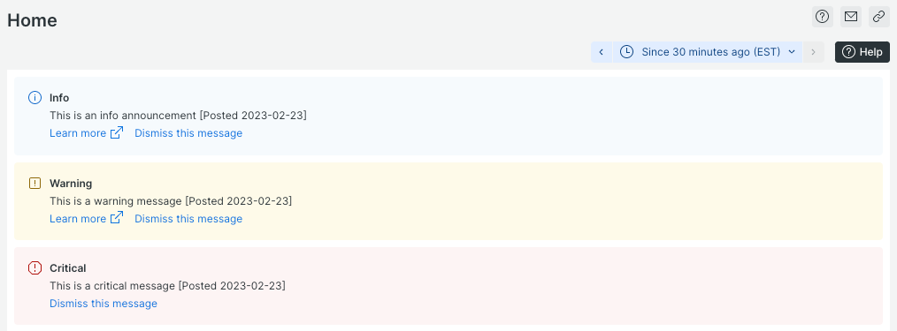

# Messages

The `Messages` component offers a simple mechanism to push informational messages to your 3rd party nerdpacks; this can be very useful to proactively inform customers of upcoming changes, or newly released features.



## usage

### messages file

The `Messages` component will load target messages listed in a `.json` file, stored in a publicly available GitHub repository. The json object is expected to define an array called `messages`, containing message objects.

#### attributes

Each message object consists of the following attributes:

`date`: mandatory, format `YYYY-MM-DD`

`level`: optional, one of: `info` (default), `warning`, `critical`

`title`: optional

`desc`: mandatory

`link`: optional, object with structure `{ "label": "display value", "to": "a valid url" }`

#### example

```
{
  messages: [
    {
      "date": "2023-02-20",
      "title": "Info",
      "desc": "This is an info message",
      "link": {"label": "See more", "to": "https://www.google.com"}
    },
    {
      "date": "2023-02-20",
      "level": "warning",
      "desc": "This is a warning message"
    },
    {
      "date": "2023-02-20",
      "level": "critical",
      "title": "Critical",
      "desc": "This is a critical message",
      "link": {"label": "See more", "to": "https://www.google.com"}
    }
  ]
}
```

### Messages component

The `Messages` component will load the raw version of a `.json` file located in a public GitHub repository, and display the valid messages defined there as New Relic [`SectionMessages`](https://developer.newrelic.com/components/section-message). The type of `SectionMessage` used will be based on the `message.level` defined in the .json file.

#### Message actions

Each message can include an optional link, as defined in the `.json` file.

All messages will automatically include an action to dismiss the message. Dismissed messages are saved to `UserNerdStorage`, and will not be displayed again to that user. Dismissed messages are identified uniquely by a combination of `message.date + message.desc.substring(0,30)` - this id is used to match a dismissed message to its counterpart in the `.json` file.

#### Message display rules

All messages are displayed in the order they appear in the file, except:

- messages missing mandatory attributes (`date`, `desc`)
- messages older than the `timeoutPeriod` (based on the message `date` attribute)
- messages previously dismissed by the user

The date of the message will be automatically appended to the description.

#### Message update and refresh

To update the messages displayed to the user, just make the necessary edits to the `.json` file and commit them to the repo. The `Messages` component will read in the latest version of the messages file on initial load, and retain that set of messages in state.

The `Messages` component will automatically reload the messages file once every 24 hours, to ensure nerdpacks that are left up and running for long periods of time will receive new messages, and clean up old ones.

#### props

`org`: The GitHub organization to be injected into the URL for the messages file. Optional - default is `newrelic`

`repo`: The name of the GitHub repository as it appears in the repo URL. Mandatory.

`branch`: The name of the repository branch where the file is located. Optional - default is `main`

`directory`: The directory within the repo where the file is located. Optional - default is root

`filename`: The name of the messages file. Optional - default is `messages`

`timeoutPeriod`: The duration in seconds after which messages will no longer be displayed. Optional - default is `1210000` (2 weeks)

`className`: class name to append to the component

`style`: inline style for custom styling

## examples

At its most basic, you only need to provide the repo name. In this example, the Messages component will load messages from the hypothetical location `https://raw.githubusercontent.com/newrelic/messages-example/main/messages.json`. Messages older than 2 weeks will not be displayed.

```
...
import { Messages } from "@newrelic/nr-labs-components"
...

const Nerdlet = (props) => {
  return (
    <>
    <Messages repo='messages-example' />
    ...
    </>
  )
}

```

In this example, the `Messages` component will load messages from the hypothetical location `https://raw.githubusercontent.com/newrelic-experimental/messages-example/dev/nerdlet/mymessages.json`. Messages older then 3 days will not be displayed.

```
...
import { Messages } from "@newrelic/nr-labs-components"
...

const Nerdlet = (props) => {
  return (
    <>
    <Messages
      org='newrelic-experimental'
      repo='messages-example'
      branch='dev'
      directory='nerdlet'
      file='mymessages'
      timeoutPeriod={259200} />
    ...
    </>
  )
}

```
